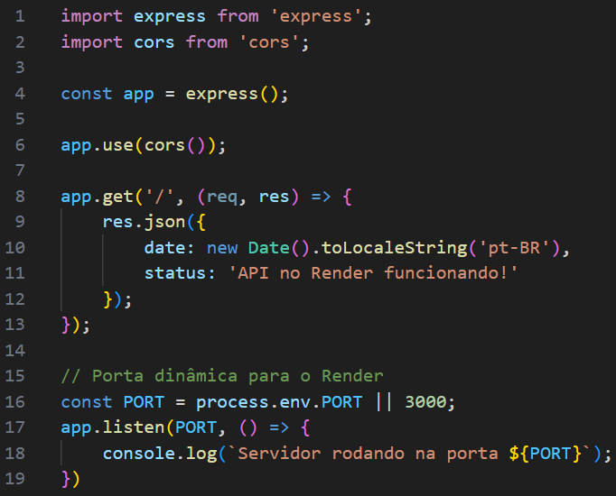
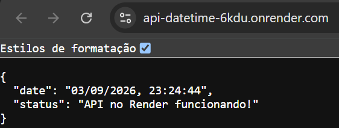
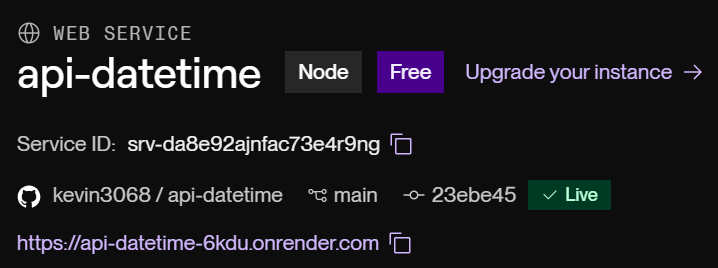
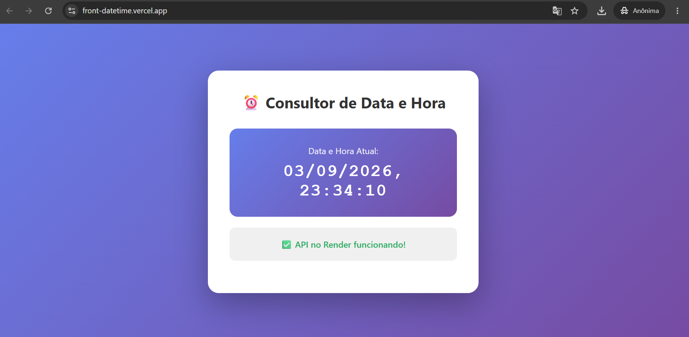
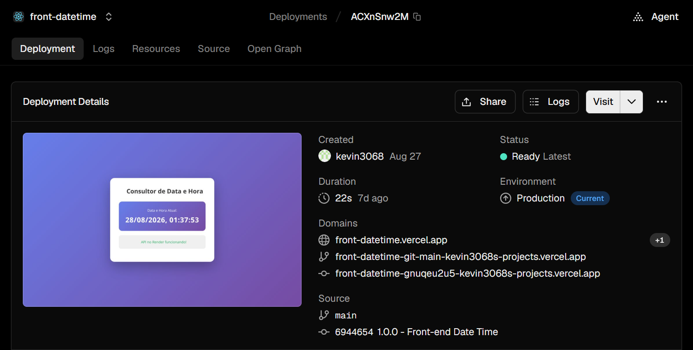

# Atividade 2 — API com Express e Aplicação Frontend

## Descrição

A atividade consistiu na criação de uma API utilizando **Express**, com uma rota responsável por consultar e retornar a data e a hora atuais.

A API foi publicada no **Render**, utilizando um repositório do GitHub conectado à plataforma para realizar o deploy e manter a aplicação acessível online.

Em seguida, foi desenvolvida uma aplicação frontend responsável por consumir a API e apresentar na tela a data e a hora retornadas.

Para organizar melhor o projeto, a API e o frontend foram separados em repositórios diferentes.

## Objetivos da Atividade

- Criar uma API utilizando Express;
- Definir uma rota para consulta de data e hora;
- Versionar a API utilizando Git;
- Publicar a API no GitHub;
- Realizar o deploy da API no Render;
- Desenvolver uma aplicação frontend;
- Consumir a API por meio do frontend;
- Exibir a data e a hora na tela;
- Separar a API e o frontend em repositórios diferentes;
- Publicar o frontend na Vercel;
- Documentar o desenvolvimento utilizando prints e links.

## Estrutura do Projeto

A atividade foi dividida em dois projetos independentes:

### Projeto 1: API

A API foi desenvolvida utilizando Express e possui uma rota responsável por retornar a data e a hora atuais.

- **Repositório no GitHub:** [Acessar repositório da API](https://github.com/kevin3068/api-datetime)
- **Deploy da API no Render:** [Acessar API publicada](https://api-datetime-6kdu.onrender.com)

### Projeto 2: Frontend

O frontend foi desenvolvido para consumir a API e exibir os dados de data e hora na tela.

- **Repositório no GitHub:** [Acessar repositório do Frontend](https://github.com/kevin3068/front-datetime)
- **Deploy do Frontend na Vercel:** [Acessar aplicação publicada](https://front-datetime.vercel.app)

## Funcionamento da Aplicação

O funcionamento da aplicação ocorre da seguinte forma:

1. A API é executada utilizando Express;
2. A rota de consulta é acessada pelo frontend;
3. A API processa a requisição;
4. A data e a hora atuais são retornadas;
5. O frontend recebe os dados da API;
6. A data e a hora são apresentadas na tela;
7. A API permanece hospedada no Render;
8. O frontend permanece hospedado na Vercel.

## Prints da API

### Código da API



### API em Funcionamento




### Painel do Render



## Prints do Frontend

### Código do Frontend

O arquivo `App.js` foi responsável por realizar a requisição à API e exibir a data e a hora na aplicação.

```jsx
import React, { useState, useEffect } from 'react';
import './App.css';

function App() {
  const [dateTime, setDateTime] = useState(null);
  const [status, setStatus] = useState('');
  const [loading, setLoading] = useState(true);
  const [error, setError] = useState(null);

  useEffect(() => {
    const fetchDateTime = async () => {
      try {
        setLoading(true);
        const apiUrl = process.env.REACT_APP_API_URL || 'http://localhost:3000';
        const response = await fetch(`${apiUrl}/`);
        
        if (!response.ok) {
          throw new Error('Erro ao conectar à API');
        }
        
        const data = await response.json();
        setDateTime(data.date);
        setStatus(data.status);
        setError(null);
      } catch (err) {
        setError(err.message);
        console.error('Erro:', err);
      } finally {
        setLoading(false);
      }
    };

    fetchDateTime();
    
    // Atualizar a cada 1 segundo
    const interval = setInterval(fetchDateTime, 1000);
    
    return () => clearInterval(interval);
  }, []);

  return (
    <div className="App">
      <div className="container">
        <h1>⏰ Consultor de Data e Hora</h1>
        
        {loading && <p className="loading">Carregando...</p>}
        
        {error && (
          <div className="error">
            <p>❌ Erro: {error}</p>
            <p className="hint">Verifique se a API está rodando</p>
          </div>
        )}
        
        {dateTime && (
          <div className="content">
            <div className="datetime-box">
              <p className="label">Data e Hora Atual:</p>
              <p className="datetime">{dateTime}</p>
            </div>
            
            <div className="status-box">
              <p className="status">✅ {status}</p>
            </div>
          </div>
        )}
      </div>
    </div>
  );
}

export default App;
```

### Aplicação em Funcionamento



### Painel da Vercel



## Tecnologias Utilizadas

- Node.js;
- Express;
- JavaScript;
- Git;
- GitHub;
- Render;
- Vercel;
- HTML;
- CSS;
- Aplicação frontend para consumo da API.

## Conclusão

A atividade permitiu desenvolver e publicar uma API utilizando Express, além de criar uma aplicação frontend capaz de consumir os dados disponibilizados pela API.

A separação entre os projetos facilitou a organização do código e possibilitou realizar o deploy de cada parte em uma plataforma específica. A API foi hospedada no Render e o frontend foi publicado na Vercel.

Ao final, a aplicação ficou disponível online, permitindo consultar a data e a hora por meio da API e exibir essas informações na interface frontend.
