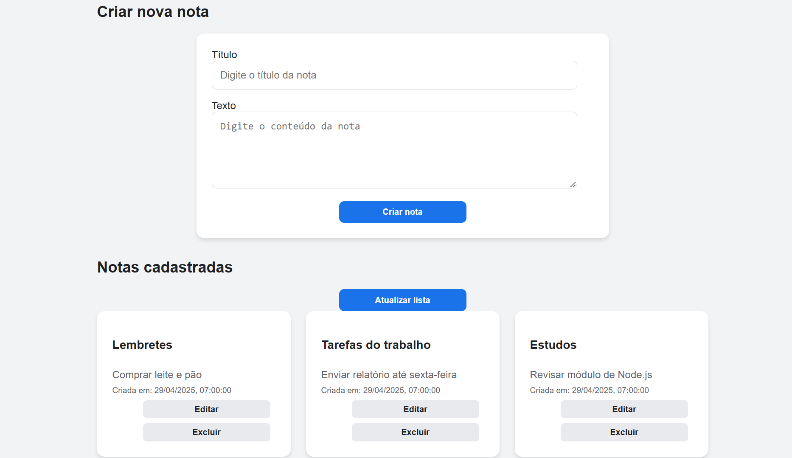
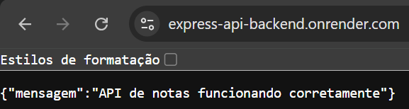

# 📝 Aplicação de Notas com API RESTful

## Descrição do Projeto

Aplicação full-stack para gerenciamento de notas desenvolvida com **Node.js/Express.js** no backend e **React** no frontend. A aplicação implementa uma API RESTful completa com funcionalidades de CRUD (Create, Read, Update, Delete), armazenando dados em arquivo JSON.

---

## 📋 Requisitos Funcionais

### Backend - API RESTful

- **Listar Notas (GET /api/notes)**: Retorna todas as notas armazenadas
- **Criar Nota (POST /api/notes)**: Adiciona uma nova nota com título e texto. Gera ID único usando `Date.now().toString()` e data de criação
- **Obter Nota por ID (GET /api/notes/:id)**: Retorna uma nota específica pelo ID
- **Atualizar Nota (PUT /api/notes/:id)**: Atualiza título e texto de uma nota existente
- **Excluir Nota (DELETE /api/notes/:id)**: Remove uma nota, retornando status 204

### Frontend - Aplicação React

- Interface intuitiva para criar, visualizar, editar e excluir notas
- Consumo da API RESTful em tempo real
- Validação de campos obrigatórios (título e texto)
- Mensagens de feedback ao usuário (sucesso e erro)
- Design responsivo e amigável
- Carregamento dinâmico de notas

---

## 🔗 Links Importantes

### Repositórios
- **[Repositório Backend (GitHub)](https://github.com/kevin3068/express-api-backend)**
- **[Repositório Frontend (GitHub)](https://github.com/kevin3068/express-api-frontend)**

### Deploy
- **[Deploy Backend (Render)](https://express-api-backend.onrender.com)**
- **[Deploy Frontend (Vercel)](https://express-api-frontend-six.vercel.app)**

---

## 🛠️ Tecnologias Utilizadas

### Backend
- **Node.js** - Runtime JavaScript para servidor
- **Express.js** - Framework web minimalista e flexível
- **Body Parser** - Middleware para parsing de requisições JSON
- **File System (fs)** - Módulo nativo para gerenciamento de arquivo JSON
- **Path** - Módulo para manipulação de caminhos de arquivos

### Frontend
- **React** - Biblioteca JavaScript para construção de interfaces
- **Fetch API** - Interface nativa para requisições HTTP

### Deployment e Versionamento
- **Git e GitHub** - Controle de versão
- **Render** - Plataforma para deploy do backend
- **Vercel** - Plataforma para deploy do frontend

---

## 💻 Código-Fonte

### Backend - server.js

```javascript
// Importa as bibliotecas utilizadas no projeto
const express = require("express");
const bodyParser = require("body-parser");
const fs = require("fs");
const path = require("path");

const app = express();

// O Render fornece a porta pela variável de ambiente PORT.
// Quando executado localmente, será utilizada a porta 3000.
const PORT = process.env.PORT || 3000;

// Garante que o arquivo data.json seja encontrado
// independentemente do local onde o comando for executado.
const FILE = path.join(__dirname, "data.json");

// Permite receber dados no formato JSON
app.use(bodyParser.json());

// Configuração do CORS
app.use((req, res, next) => {
  res.header("Access-Control-Allow-Origin", "*");
  res.header(
    "Access-Control-Allow-Headers",
    "Origin, X-Requested-With, Content-Type, Accept"
  );
  res.header(
    "Access-Control-Allow-Methods",
    "GET, POST, PUT, DELETE, OPTIONS"
  );

  // Responde às requisições automáticas de verificação do navegador
  if (req.method === "OPTIONS") {
    return res.sendStatus(204);
  }

  next();
});

// Rota inicial para verificar se a API está funcionando
app.get("/", (req, res) => {
  res.json({
    mensagem: "API de notas funcionando corretamente"
  });
});

// Função responsável por ler as notas do arquivo JSON
function readNotes() {
  try {
    // Se o arquivo ainda não existir, ele será criado vazio
    if (!fs.existsSync(FILE)) {
      fs.writeFileSync(FILE, "[]");
    }

    const data = fs.readFileSync(FILE, "utf-8");

    // Caso o arquivo esteja vazio, retorna um array vazio
    if (!data.trim()) {
      return [];
    }

    return JSON.parse(data);
  } catch (error) {
    console.error("Erro ao ler o arquivo data.json:", error);
    return [];
  }
}

// Função responsável por salvar as notas no arquivo JSON
function saveNotes(notes) {
  fs.writeFileSync(FILE, JSON.stringify(notes, null, 2), "utf-8");
}

// Valida os campos obrigatórios da nota
function validateNote(titulo, texto) {
  if (
    typeof titulo !== "string" ||
    typeof texto !== "string" ||
    titulo.trim() === "" ||
    texto.trim() === ""
  ) {
    return false;
  }

  return true;
}

// ======================================
// GET /api/notes
// Lista todas as notas cadastradas
// ======================================
app.get("/api/notes", (req, res) => {
  const notes = readNotes();

  res.status(200).json(notes);
});

// ======================================
// GET /api/notes/:id
// Busca uma nota específica pelo ID
// ======================================
app.get("/api/notes/:id", (req, res) => {
  const notes = readNotes();

  const note = notes.find((item) => item.id === req.params.id);

  if (!note) {
    return res.status(404).json({
      erro: "Nota não encontrada"
    });
  }

  res.status(200).json(note);
});

// ======================================
// POST /api/notes
// Cria uma nova nota
// ======================================
app.post("/api/notes", (req, res) => {
  const { titulo, texto } = req.body;

  if (!validateNote(titulo, texto)) {
    return res.status(400).json({
      erro: "Os campos titulo e texto são obrigatórios"
    });
  }

  const notes = readNotes();

  const novaNota = {
    id: Date.now().toString(),
    titulo: titulo.trim(),
    texto: texto.trim(),
    criadoEm: new Date().toISOString()
  };

  notes.push(novaNota);
  saveNotes(notes);

  res.status(201).json(novaNota);
});

// ======================================
// PUT /api/notes/:id
// Atualiza uma nota existente
// ======================================
app.put("/api/notes/:id", (req, res) => {
  const { titulo, texto } = req.body;

  if (!validateNote(titulo, texto)) {
    return res.status(400).json({
      erro: "Os campos titulo e texto são obrigatórios"
    });
  }

  const notes = readNotes();

  const index = notes.findIndex((item) => item.id === req.params.id);

  if (index === -1) {
    return res.status(404).json({
      erro: "Nota não encontrada"
    });
  }

  notes[index] = {
    ...notes[index],
    titulo: titulo.trim(),
    texto: texto.trim()
  };

  saveNotes(notes);

  res.status(200).json(notes[index]);
});

// ======================================
// DELETE /api/notes/:id
// Exclui uma nota existente
// ======================================
app.delete("/api/notes/:id", (req, res) => {
  const notes = readNotes();

  const index = notes.findIndex((item) => item.id === req.params.id);

  if (index === -1) {
    return res.status(404).json({
      erro: "Nota não encontrada"
    });
  }

  notes.splice(index, 1);
  saveNotes(notes);

  // Status 204 indica que a operação foi realizada
  // e não haverá conteúdo no corpo da resposta.
  res.status(204).send();
});

// Inicia o servidor
app.listen(PORT, "0.0.0.0", () => {
  console.log(`Servidor rodando na porta ${PORT}`);
});
```

---

### Frontend - App.js

```javascript
import React, { useEffect, useState } from "react";
import "./App.css";

// Durante o desenvolvimento local:
// const API_URL = "http://localhost:3000/api/notes";

const API_URL =
  "https://express-api-backend.onrender.com/api/notes";

function App() {
  const [notas, setNotas] = useState([]);
  const [form, setForm] = useState({
    titulo: "",
    texto: "",
    id: null
  });

  const [carregando, setCarregando] = useState(true);
  const [mensagem, setMensagem] = useState("");
  const [erro, setErro] = useState("");

  useEffect(() => {
    buscarNotas();
  }, []);

  async function buscarNotas() {
    try {
      setCarregando(true);
      setErro("");

      const resposta = await fetch(API_URL);

      if (!resposta.ok) {
        throw new Error("Não foi possível carregar as notas.");
      }

      const dados = await resposta.json();
      setNotas(dados);
    } catch (error) {
      setErro(error.message);
    } finally {
      setCarregando(false);
    }
  }

  function handleChange(event) {
    const { name, value } = event.target;

    setForm((estadoAnterior) => ({
      ...estadoAnterior,
      [name]: value
    }));
  }

  function limparFormulario() {
    setForm({
      titulo: "",
      texto: "",
      id: null
    });
  }

  async function handleSubmit(event) {
    event.preventDefault();

    if (!form.titulo.trim() || !form.texto.trim()) {
      setErro("Preencha o título e o texto da nota.");
      return;
    }

    try {
      setErro("");
      setMensagem("");

      const editando = form.id !== null;
      const metodo = editando ? "PUT" : "POST";
      const url = editando
        ? `${API_URL}/${form.id}`
        : API_URL;

      const resposta = await fetch(url, {
        method: metodo,
        headers: {
          "Content-Type": "application/json"
        },
        body: JSON.stringify({
          titulo: form.titulo,
          texto: form.texto
        })
      });

      const dados = await resposta.json();

      if (!resposta.ok) {
        throw new Error(
          dados.erro || "Não foi possível salvar a nota."
        );
      }

      setMensagem(
        editando
          ? "Nota atualizada com sucesso!"
          : "Nota criada com sucesso!"
      );

      limparFormulario();
      buscarNotas();
    } catch (error) {
      setErro(error.message);
    }
  }

  function handleEdit(nota) {
    setForm({
      titulo: nota.titulo,
      texto: nota.texto,
      id: nota.id
    });

    setMensagem("");
    setErro("");

    window.scrollTo({
      top: 0,
      behavior: "smooth"
    });
  }

  async function handleDelete(id) {
    const confirmar = window.confirm(
      "Deseja realmente excluir esta nota?"
    );

    if (!confirmar) {
      return;
    }

    try {
      setErro("");
      setMensagem("");

      const resposta = await fetch(`${API_URL}/${id}`, {
        method: "DELETE"
      });

      if (!resposta.ok) {
        let dados = {};

        try {
          dados = await resposta.json();
        } catch {
          dados = {};
        }

        throw new Error(
          dados.erro || "Não foi possível excluir a nota."
        );
      }

      setMensagem("Nota excluída com sucesso!");
      buscarNotas();
    } catch (error) {
      setErro(error.message);
    }
  }

  return (
    <main className="container">
      <section className="cabecalho">
        <h1>Minhas Notas</h1>
        <p>
          Aplicação frontend conectada a uma API RESTful.
        </p>
      </section>

      <section className="card formulario-card">
        <h2>
          {form.id ? "Editar nota" : "Criar nova nota"}
        </h2>

        {mensagem && (
          <p className="mensagem sucesso">{mensagem}</p>
        )}

        {erro && (
          <p className="mensagem erro">{erro}</p>
        )}

        <form onSubmit={handleSubmit}>
          <label htmlFor="titulo">Título</label>

          <input
            id="titulo"
            name="titulo"
            type="text"
            placeholder="Digite o título da nota"
            value={form.titulo}
            onChange={handleChange}
            required
          />

          <label htmlFor="texto">Texto</label>

          <textarea
            id="texto"
            name="texto"
            placeholder="Digite o conteúdo da nota"
            value={form.texto}
            onChange={handleChange}
            rows="5"
            required
          />

          <div className="acoes-formulario">
            <button type="submit" className="botao principal">
              {form.id ? "Atualizar nota" : "Criar nota"}
            </button>

            {form.id && (
              <button
                type="button"
                className="botao secundario"
                onClick={limparFormulario}
              >
                Cancelar edição
              </button>
            )}
          </div>
        </form>
      </section>

      <section className="lista-notas">
        <div className="titulo-lista">
          <h2>Notas cadastradas</h2>

          <button
            type="button"
            className="botao atualizar"
            onClick={buscarNotas}
          >
            Atualizar lista
          </button>
        </div>

        {carregando && <p>Carregando notas...</p>}

        {!carregando && notas.length === 0 && (
          <p className="sem-notas">
            Nenhuma nota cadastrada.
          </p>
        )}

        <div className="notas-grid">
          {notas.map((nota) => (
            <article className="nota" key={nota.id}>
              <h3>{nota.titulo}</h3>

              <p className="texto-nota">{nota.texto}</p>

              <small>
                Criada em:{" "}
                {nota.criadoEm
                  ? new Date(
                      nota.criadoEm
                    ).toLocaleString("pt-BR")
                  : "Data não informada"}
              </small>

              <div className="acoes-nota">
                <button
                  type="button"
                  className="botao editar"
                  onClick={() => handleEdit(nota)}
                >
                  Editar
                </button>

                <button
                  type="button"
                  className="botao excluir"
                  onClick={() => handleDelete(nota.id)}
                >
                  Excluir
                </button>
              </div>
            </article>
          ))}
        </div>
      </section>
    </main>
  );
}

export default App;
```

---

## 📸 Capturas de Tela da Aplicação

### Aplicação Frontend



*Tela inicial com o formulário para criar notas e seção de notas cadastradas.*

---

### API Backend no Render



*API RESTful no Render mostrando que está funcionando após acessar o seu link.*

---
